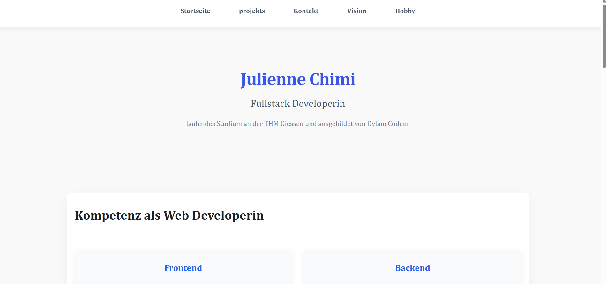

# Mein Portfolio

Dies ist ein einfaches, responsives Portfolio, das mit **HTML** und **CSS** erstellt wurde. Es zeigt meine Projekte, Fähigkeiten und bietet eine kurze Übersicht über mich als Entwickler:in.

##  Features

- **Responsives Design**: Optimiert für Desktop, Tablet und Smartphone.
- **Klar strukturierte Sektionen**:
  - Über mich
  - Projekte
  - Kontakt
- **Modernes Layout** mit sauberem, minimalistischem Stil.

##  Verwendete Technologien

- HTML5
- CSS3 (inkl. Media Queries für Responsivität)

## 📸 Vorschau



##  Projektstruktur

```bash
portfolio/
├── index.html
├── style.css
├── contact.html
├── projets.html
├── vision.html
└── assets/
    └── bilder/
